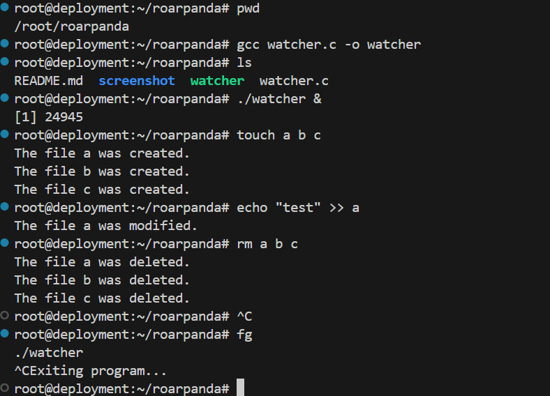

# roarpanda-watcher
===========================
## 简介
roarpanda-watcher是一个简单的文件监控工具，用于监控指定目录下的文件变化。

## 环境要求
Linux内核支持inotify(at least 2.6.13)，可以检查/usr/include/linux/inotify.h文件是否存在，确定是否支持inotify。

## 编译、运行、测试
1. 准备环境
    ```
    mkdir -p /root/roarpanda && cd /root/roarpanda
    ```

2. 编译c代码
    ```
    gcc watcher.c -o watcher
    ```

3. 启动watcher进程(默认监控/root/roarpanda目录，可通过第一个参数自定义监控目录)
    ```
    ./watcher&
    ```

4. 在/root/roarpanda目录下操作(创建/修改/删除)文件，查看watcher的输出

5. 退出watcher进程(ctrl+c)


## 测试截图
